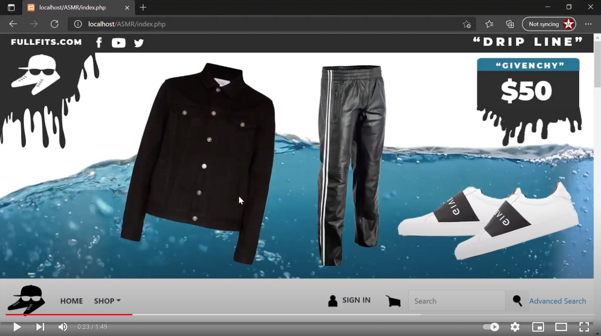

# Full_Fits_1.0_PHP
First version of an ecommerce website that was written with PHP, python, and SQL. I created this project with a small group in year one at Humber College Computer Programming.

## Features
* SQL connection with python
* list items with pictures, titles, and price
* sign in with Google Account
* Paypal Checkout API
* filter item by category
* bootstrap responsive UI
* search items
* item details page 
* add too cart drawer
* email confirmations
* checkout page
* save user info for shipping

## Demo Video

